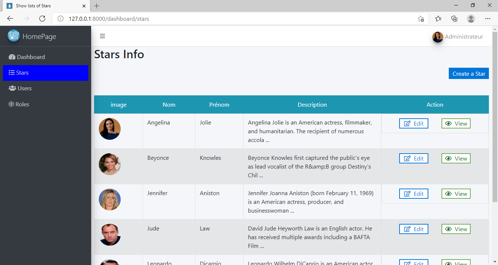

<p align="center"><a href="https://laravel.com" target="_blank"></a></p>

<p align="center">
<a href="https://travis-ci.org/laravel/framework"></a>
<a href="https://packagist.org/packages/laravel/framework"></a>
<a href="https://packagist.org/packages/laravel/framework"></a>
<a href="https://packagist.org/packages/laravel/framework"></a>
</p>

# StarsApp

A simple application created with laravel and javascript.

## Table of Contents

-   [General info](#general-info)
-   [Technologies](#technologies)
-   [Requirements](#requirements)
-   [Features](#features)
-   [Setup](#setup)
-   [Site](#site)

## General info

This project is a skill test project that displays a celebrities information in different formats depending on the screen sizes. It also allows an administrator to manage the information displayed on the screen through the dashboard.

## Technologies

This project was created with:

-   Laravel
-   Javascript
-   Html5
-   CSS3

## Requirements

-   Node Js
-   Composer
-   Code editeur e.g VS code
-   A database e.g MySQL
-   Run npm install to install dependencies

## Features

-   Edit, Delete, Update and Create a celebrity profile from the dashboard
-   Edit, Delete, Update and Create a user profile from the dashboard
-   Routing users based on user roles

## Setup

To run this project, install it locally as follows

-   Download the Zip file to your computer or Open it with Github Desktop
-   if you downloaded the zipped file, unzip the file using applications like winrar, 7-zip e.tc
-   Create a MySQL database called **star_lists**.

*   Import the file called star_lists.sql that is located in the unzipped file into the database you just created.
    **NOTE**: The database character set should be **utf8_general_ci** and the character set for the file during upload should be **utf8**.

-   Open the folder after unzipping it in your code editor of choice e.g VSCode, PHPStorm e.t.c
-   Open a terminal to install the php dependencies using the command

```bash
$ composer install
```

-   Also install the javascript dependencies using the command

```bash
$ npm install
```

-   Launch the application with

```bash
$ php artisan serve
```

## users for test running the app

-   Admin:

    -   email: admin@admin.com
    -   password: password

-   User
    -   email: king@gmail.com
    -   password: testpassword

## Site

### Stars Lists on Large Screen



### Stars Lists on Small Screen


## Sources

This application was inspired by a skill test for a job application in Laravel with HelloCSE.

## Packages

-   [html purifier](https://github.com/mewebstudio/Purifier)
-   [tinyMCE](https://www.tiny.cloud/)
